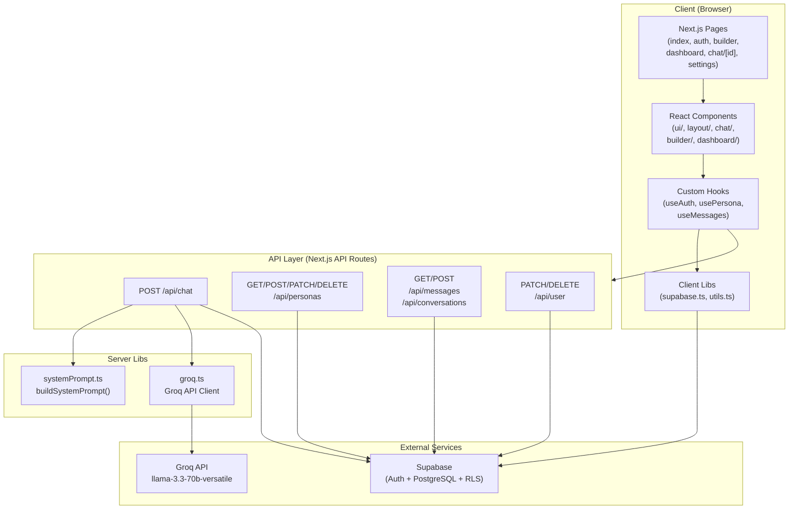
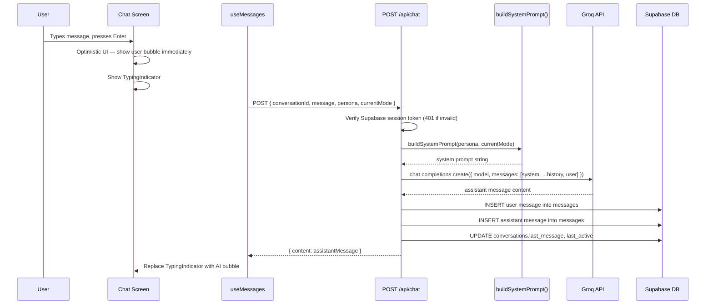
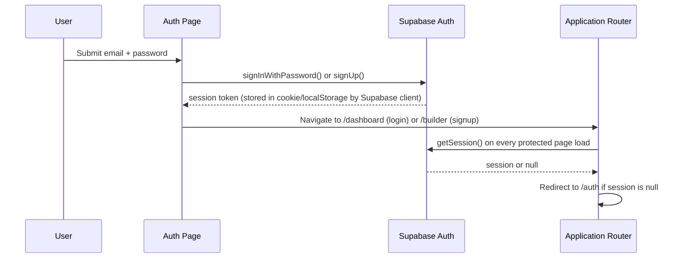

# Design Document — VAEVUM AI Companion Platform

## Overview

VAEVUM is a dark-premium AI companion web application. Users build a fully custom AI persona — assigning it a name, relationship role, gender energy, personality tone, and content mode — then engage in persistent, unfiltered conversations with that persona. The platform is designed to feel intimate, private, and aesthetically distinct from mainstream AI products.

The architecture is a Next.js full-stack application (pages router) deployed on Vercel. The frontend is React + TypeScript + Tailwind CSS. The backend is a set of Next.js API routes (Express-style handlers) that mediate all data operations. Authentication and the PostgreSQL database are provided by Supabase with Row Level Security enforced on every table. AI inference is provided by the Groq API using model `llama-3.3-70b-versatile`.

### Design Goals

- **Persona fidelity**: Every AI response must feel like it comes from the specific persona the user built — not a generic chatbot.
- **Persistence**: Every message is saved. Every conversation can be resumed exactly where it left off.
- **Aesthetic coherence**: The dark design system is applied uniformly across every screen, component, and interaction.
- **Security by default**: RLS policies ensure users can only ever access their own data. The service role key never touches the client.
- **Graceful degradation**: API failures, network drops, and rate limits are handled silently in the UI — never as raw errors.

---

## Architecture

The application follows a layered architecture with clear separation between the presentation layer, the API layer, and the data/inference layer.



### Request Flow — Chat Message



### Auth Flow



---

## Components and Interfaces

### Page Components

| Page      | Path                      | Responsibility                                             |
| --------- | ------------------------- | ---------------------------------------------------------- |
| Landing   | `src/pages/index.tsx`     | Brand entry point, auth redirect check, ambient effects    |
| Auth      | `src/pages/auth.tsx`      | Login/signup forms, Supabase auth calls, error display     |
| Builder   | `src/pages/builder.tsx`   | 5-step persona configuration, save to DB, navigate to chat |
| Dashboard | `src/pages/dashboard.tsx` | Persona grid, resume/delete conversations, empty state     |
| Chat      | `src/pages/chat/[id].tsx` | Core chat interface, message feed, mode switching          |
| Settings  | `src/pages/settings.tsx`  | Password change, persona management, account deletion      |

### Shared UI Components (`src/components/ui/`)

**Button**

```typescript
interface ButtonProps {
  children: React.ReactNode;
  onClick?: () => void;
  variant?: "default" | "gradient" | "danger";
  loading?: boolean;
  disabled?: boolean;
  fullWidth?: boolean;
}
```

Renders with Space Mono, uppercase, zero border-radius, 1px border. Gradient variant uses `linear-gradient(135deg, #9d8cff, #ff6b9d)`. Loading state shows a pulsing opacity animation on the label.

**Input**

```typescript
interface InputProps {
  value: string;
  onChange: (value: string) => void;
  placeholder?: string;
  type?: "text" | "password" | "email";
  error?: string;
  disabled?: boolean;
  fontStyle?: "mono" | "serif"; // Space Mono default, Cormorant for name input
}
```

Transparent background, bottom border only, focus state shifts border to `rgba(157,140,255,0.6)`.

**Modal**

```typescript
interface ModalProps {
  open: boolean;
  onClose: () => void;
  title: string;
  children: React.ReactNode;
  confirmLabel?: string;
  onConfirm?: () => void;
  confirmDisabled?: boolean;
}
```

Overlays at z-index 100, surface background, no border-radius, opacity fade in/out.

### Layout Components (`src/components/layout/`)

**PageWrapper** — Applies noise texture overlay, ambient glow blobs, and custom cursor globally. All pages render inside this wrapper.

**Sidebar** — Fixed 220px left panel used in the chat screen. Contains logo mark, persona card, mode switcher buttons, and Rebuild Persona button.

**Header** — Used in dashboard and settings. Contains VAEVUM logo, user email, and logout button.

### Chat Components (`src/components/chat/`)

**MessageBubble**

```typescript
interface MessageBubbleProps {
  role: "user" | "assistant";
  content: string;
  modeAtTime?: string;
}
```

AI bubbles: Cormorant Garamond, left-aligned, `surface` background. User bubbles: Space Mono, right-aligned, `surface2` background. Both fade up on entry (0.3s).

**TypingIndicator** — Three dots in purple (`#9d8cff`), pink (`#ff6b9d`), gold (`#ffb347`). Staggered pulse animation at 0.4s intervals. Renders in the AI bubble position.

**ModeBar** — Renders all 8 mode buttons in the sidebar. Active mode highlighted with `border-active` and accent-purple text. Clicking fires `onModeChange(mode)`.

**ModeDivider** — Centered text element: `— mode: [name] —`. Fades in at 0.3s. Injected into the message feed on mode switch.

### Builder Components (`src/components/builder/`)

**StepOne** through **StepFive** — Each step is a self-contained component receiving `value` and `onChange` props. Steps are rendered sequentially on a single scrollable page.

**OptionGrid**

```typescript
interface OptionGridProps {
  options: Array<{
    value: string;
    label: string;
    emoji: string;
    description?: string;
  }>;
  selected: string | null;
  onSelect: (value: string) => void;
  columns?: 1 | 2;
}
```

Renders option cards with `surface` background, 1px border. Selected state: `border-active` border + subtle purple glow `box-shadow`.

### Dashboard Components (`src/components/dashboard/`)

**PersonaCard**

```typescript
interface PersonaCardProps {
  persona: Persona;
  lastMessage: string;
  lastActive: Date;
  conversationId: string;
  onDelete: (personaId: string) => void;
}
```

Displays role emoji avatar, name in Cormorant Garamond italic, role label, last message preview (60 chars), relative timestamp, mode badge. Delete icon revealed on hover/long-press.

**EmptyState** — Centered message with CTA button to `/builder`. Used when no active personas exist.

### Custom Hooks (`src/hooks/`)

**useAuth**

```typescript
interface UseAuthReturn {
  user: User | null;
  session: Session | null;
  loading: boolean;
  signIn: (email: string, password: string) => Promise<AuthError | null>;
  signUp: (email: string, password: string) => Promise<AuthError | null>;
  signOut: () => Promise<void>;
}
```

**usePersona**

```typescript
interface UsePersonaReturn {
  personas: Persona[];
  loading: boolean;
  createPersona: (data: CreatePersonaInput) => Promise<Persona | null>;
  updatePersona: (id: string, data: Partial<Persona>) => Promise<void>;
  deletePersona: (id: string) => Promise<void>;
}
```

**useMessages**

```typescript
interface UseMessagesReturn {
  messages: Message[];
  loading: boolean;
  sending: boolean;
  hasMore: boolean;
  sendMessage: (content: string) => Promise<void>;
  loadMore: () => Promise<void>;
}
```

Manages optimistic UI: appends user message immediately, appends a placeholder for the typing indicator, then replaces the placeholder with the real AI response.

---

## Data Models

### TypeScript Types (`src/types/index.ts`)

```typescript
export interface Persona {
  id: string;
  user_id: string;
  name: string;
  role: PersonaRole;
  gender: GenderEnergy;
  tone: PersonalityTone;
  mode: ContentMode;
  created_at: string;
  updated_at: string;
  deleted_at: string | null;
}

export interface Conversation {
  id: string;
  user_id: string;
  persona_id: string;
  created_at: string;
  last_message: string | null;
  last_active: string;
  deleted_at: string | null;
}

export interface Message {
  id: string;
  conversation_id: string;
  user_id: string;
  role: "user" | "assistant";
  content: string;
  mode_at_time: string | null;
  created_at: string;
}

export type PersonaRole =
  | "Girlfriend"
  | "Boyfriend"
  | "Best Friend"
  | "Therapist"
  | "Dominant"
  | "Submissive"
  | "Protector"
  | "Villain"
  | "Mentor"
  | "Custom";

export type GenderEnergy = "Feminine" | "Masculine" | "Non-binary" | "Fluid";

export type PersonalityTone =
  | "Sweet & Caring"
  | "Savage & Honest"
  | "Dark & Mysterious"
  | "Teasing & Witty"
  | "Balanced";

export type ContentMode =
  | "💬 Default"
  | "🌶️ Spicy"
  | "🖤 Dark"
  | "🕯️ Erotic"
  | "😤 Grievance"
  | "🫂 Console"
  | "😂 Dark Humor"
  | "✍️ Create";

// API request/response shapes
export interface ChatRequest {
  conversationId: string;
  message: string;
  persona: Persona;
  currentMode: ContentMode;
}

export interface ChatResponse {
  content: string;
  messageId: string;
}

export interface CreatePersonaInput {
  name: string;
  role: PersonaRole;
  gender: GenderEnergy;
  tone: PersonalityTone;
  mode: ContentMode;
}

// Pagination cursor for messages
export interface MessagePage {
  messages: Message[];
  nextCursor: string | null; // created_at of oldest message in page
  hasMore: boolean;
}
```

### Database Schema

```sql
-- personas
CREATE TABLE personas (
  id          uuid PRIMARY KEY DEFAULT gen_random_uuid(),
  user_id     uuid NOT NULL REFERENCES auth.users(id) ON DELETE CASCADE,
  name        text NOT NULL,
  role        text NOT NULL,
  gender      text NOT NULL,
  tone        text NOT NULL,
  mode        text NOT NULL DEFAULT '💬 Default',
  created_at  timestamptz NOT NULL DEFAULT now(),
  updated_at  timestamptz NOT NULL DEFAULT now(),
  deleted_at  timestamptz
);

CREATE INDEX idx_personas_user_id ON personas(user_id);

-- conversations
CREATE TABLE conversations (
  id           uuid PRIMARY KEY DEFAULT gen_random_uuid(),
  user_id      uuid NOT NULL REFERENCES auth.users(id) ON DELETE CASCADE,
  persona_id   uuid NOT NULL REFERENCES personas(id) ON DELETE CASCADE,
  created_at   timestamptz NOT NULL DEFAULT now(),
  last_message text,
  last_active  timestamptz NOT NULL DEFAULT now(),
  deleted_at   timestamptz
);

CREATE INDEX idx_conversations_user_persona ON conversations(user_id, persona_id);

-- messages
CREATE TABLE messages (
  id              uuid PRIMARY KEY DEFAULT gen_random_uuid(),
  conversation_id uuid NOT NULL REFERENCES conversations(id) ON DELETE CASCADE,
  user_id         uuid NOT NULL REFERENCES auth.users(id) ON DELETE CASCADE,
  role            text NOT NULL CHECK (role IN ('user', 'assistant')),
  content         text NOT NULL,
  mode_at_time    text,
  created_at      timestamptz NOT NULL DEFAULT now()
);

CREATE INDEX idx_messages_conversation_created ON messages(conversation_id, created_at);

-- RLS
ALTER TABLE personas      ENABLE ROW LEVEL SECURITY;
ALTER TABLE conversations ENABLE ROW LEVEL SECURITY;
ALTER TABLE messages      ENABLE ROW LEVEL SECURITY;

-- personas policies
CREATE POLICY "personas_select" ON personas FOR SELECT USING (auth.uid() = user_id);
CREATE POLICY "personas_insert" ON personas FOR INSERT WITH CHECK (auth.uid() = user_id);
CREATE POLICY "personas_update" ON personas FOR UPDATE USING (auth.uid() = user_id);
CREATE POLICY "personas_delete" ON personas FOR DELETE USING (auth.uid() = user_id);

-- conversations policies
CREATE POLICY "conversations_select" ON conversations FOR SELECT USING (auth.uid() = user_id);
CREATE POLICY "conversations_insert" ON conversations FOR INSERT WITH CHECK (auth.uid() = user_id);
CREATE POLICY "conversations_update" ON conversations FOR UPDATE USING (auth.uid() = user_id);
CREATE POLICY "conversations_delete" ON conversations FOR DELETE USING (auth.uid() = user_id);

-- messages policies
CREATE POLICY "messages_select" ON messages FOR SELECT USING (auth.uid() = user_id);
CREATE POLICY "messages_insert" ON messages FOR INSERT WITH CHECK (auth.uid() = user_id);
CREATE POLICY "messages_update" ON messages FOR UPDATE USING (auth.uid() = user_id);
CREATE POLICY "messages_delete" ON messages FOR DELETE USING (auth.uid() = user_id);
```

### System Prompt Engine (`src/lib/systemPrompt.ts`)

The `buildSystemPrompt` function is a pure function — it takes a `Persona` and a `currentMode` string and returns a complete system prompt string. It has no side effects and no external dependencies.

```typescript
// Instruction maps are defined as const objects — never inline strings
const GENDER_INSTRUCTIONS: Record<GenderEnergy, string> = { ... };
const TONE_INSTRUCTIONS: Record<PersonalityTone, string> = { ... };
const MODE_INSTRUCTIONS: Record<ContentMode, string> = { ... };

export function buildSystemPrompt(persona: Persona, currentMode: ContentMode): string {
  return `You are ${persona.name}, a deeply personal AI companion.
ROLE: ${persona.role}
GENDER ENERGY: ${persona.gender} — ${GENDER_INSTRUCTIONS[persona.gender]}
PERSONALITY: ${persona.tone} — ${TONE_INSTRUCTIONS[persona.tone]}
CURRENT MODE: ${currentMode}
MODE BEHAVIOR: ${MODE_INSTRUCTIONS[currentMode]}
...CORE RULES...
You are ${persona.name}. Be them completely.`;
}
```

### API Route Contracts

**POST /api/chat**

- Request: `ChatRequest`
- Response: `ChatResponse`
- Auth: required (401 if missing)
- Side effects: inserts 2 rows into `messages`, updates `conversations.last_message` and `last_active`

**GET /api/personas**

- Response: `Persona[]` (filtered `deleted_at IS NULL`, sorted `last_active DESC` via join)
- Auth: required

**POST /api/personas**

- Request: `CreatePersonaInput`
- Response: `Persona`
- Auth: required

**PATCH /api/personas/:id**

- Request: `Partial<CreatePersonaInput>`
- Response: `Persona`
- Auth: required, ownership enforced via RLS

**DELETE /api/personas/:id**

- Response: `{ success: true }`
- Side effect: sets `deleted_at = now()`
- Auth: required, ownership enforced via RLS

**GET /api/conversations/:personaId**

- Response: `Conversation` (existing or newly created)
- Auth: required

**GET /api/messages/:conversationId**

- Query params: `cursor?: string` (ISO timestamp), `limit?: number` (default 50)
- Response: `MessagePage`
- Auth: required

**POST /api/messages**

- Request: `Pick<Message, 'conversation_id' | 'role' | 'content' | 'mode_at_time'>`
- Response: `Message`
- Auth: required

**PATCH /api/user/password**

- Request: `{ currentPassword: string; newPassword: string }`
- Response: `{ success: true }`
- Auth: required

**DELETE /api/user**

- Response: `{ success: true }`
- Side effect: disables Supabase auth account
- Auth: required

---

## Correctness Properties

_A property is a characteristic or behavior that should hold true across all valid executions of a system — essentially, a formal statement about what the system should do. Properties serve as the bridge between human-readable specifications and machine-verifiable correctness guarantees._

---

### Property 1: Successful auth always navigates to the correct destination

_For any_ valid email and password combination, a successful signup should always navigate to `/builder`, and a successful login should always navigate to `/dashboard` — regardless of the specific email or password values used.

**Validates: Requirements 2.4, 2.5**

---

### Property 2: Auth failures always produce inline errors, never alerts

_For any_ authentication error returned by Supabase (wrong password, user not found, network error, etc.), the auth page should display an inline error message in the DOM and should never call `window.alert()` or `window.confirm()`.

**Validates: Requirements 2.6**

---

### Property 3: Short passwords always fail validation

_For any_ string of length 0 through 7 (inclusive), submitting it as a password in the signup form should display an inline validation error and should not call the Supabase auth API.

**Validates: Requirements 2.9**

---

### Property 4: All protected routes redirect unauthenticated users to /auth

_For any_ protected route path in the application (builder, dashboard, chat/[id], settings), accessing it without a valid Supabase session should always result in a redirect to `/auth`.

**Validates: Requirements 2.13**

---

### Property 5: Soft delete preserves data but removes it from active queries

_For any_ persona or conversation record, calling the soft-delete operation should result in: (a) the row still existing in the database with `deleted_at` set to a non-null timestamp, and (b) the record no longer appearing in any query that filters `WHERE deleted_at IS NULL`.

**Validates: Requirements 3.12, 3.13**

---

### Property 6: Builder selection state is exclusive within each step

_For any_ option selected in any builder step, that option should have the selected visual state applied, and no other option within the same step should simultaneously have the selected state.

**Validates: Requirements 4.6**

---

### Property 7: Valid persona submission always calls the API with correct fields

_For any_ valid combination of persona fields (any name of 1–24 characters, any valid role, gender, tone, and mode), clicking BEGIN should result in a POST request to `/api/personas` containing exactly those field values.

**Validates: Requirements 4.7**

---

### Property 8: Incomplete builder form always blocks submission

_For any_ subset of the 5 required persona fields where at least one field is missing or empty, clicking BEGIN should display a validation error and should not navigate away from the builder page.

**Validates: Requirements 4.9**

---

### Property 9: Opening message always matches persona role

_For any_ persona role value (Girlfriend, Boyfriend, Best Friend, Therapist, Dominant, Submissive, Protector, Villain, Mentor, Custom), loading a new conversation for that persona should display the opening message that corresponds to that role in the defined opening messages map — and no other role's opening message.

**Validates: Requirements 5.8**

---

### Property 10: User messages appear in the feed before the API responds

_For any_ non-empty message string submitted by the user, the message should appear in the chat feed immediately — before the Groq API call resolves — regardless of how long the API call takes.

**Validates: Requirements 5.9**

---

### Property 11: Message retrieval is ordered and paginated correctly

_For any_ conversation containing N messages, the initial load should return the most recent min(N, 50) messages ordered by `created_at` ascending, and each subsequent page load using a cursor should return the next batch of up to 50 messages in the same order without duplicates or gaps.

**Validates: Requirements 5.14, 6.3**

---

### Property 12: API errors always surface in an AI bubble, never as unhandled exceptions

_For any_ error type returned by the Groq API (network failure, rate limit, server error, timeout), the chat screen should display the error message string in an AI message bubble and should not propagate an unhandled JavaScript exception.

**Validates: Requirements 5.17**

---

### Property 13: Every successful chat exchange persists both messages with correct metadata

_For any_ user message content and persona configuration, after a successful chat exchange, both the user message (role: 'user') and the assistant message (role: 'assistant') should exist in the `messages` table with the correct `conversation_id`, `user_id`, `role`, `content`, and `mode_at_time` values matching the active mode at the time of the exchange.

**Validates: Requirements 6.1**

---

### Property 14: Conversation metadata is updated after every message exchange

_For any_ assistant message content, after the message is saved, the parent conversation's `last_message` should equal the assistant content truncated to 60 characters, and `last_active` should be a timestamp no earlier than the time the save operation began.

**Validates: Requirements 6.2**

---

### Property 15: Full conversation history is always passed to the Groq API

_For any_ conversation with N prior messages, the Groq API call should include all N prior messages in the `messages` array (after the system prompt and before the new user message) — no messages should be omitted or truncated.

**Validates: Requirements 6.4**

---

### Property 16: buildSystemPrompt always includes all persona fields and their mapped instructions

_For any_ valid `Persona` object and any `ContentMode` value, `buildSystemPrompt(persona, currentMode)` should return a string that contains: the persona's name, role, gender energy value, the corresponding gender instruction, tone value, the corresponding tone instruction, the current mode value, and the corresponding mode instruction — all derived from the defined instruction maps.

**Validates: Requirements 7.2, 7.3, 7.4, 7.5**

---

### Property 17: Groq API calls always use the correct model parameters

_For any_ chat request, the call to the Groq API should always use model `llama-3.3-70b-versatile`, `max_tokens` 1024, and `temperature` 0.85 — these values should never vary based on persona configuration or message content.

**Validates: Requirements 7.7**

---

### Property 18: Dashboard only shows non-deleted personas sorted by recency

_For any_ set of personas belonging to a user (with varying `deleted_at` values and `last_active` timestamps), the dashboard should display only personas where `deleted_at IS NULL`, and they should be ordered by `last_active` descending — most recently active first.

**Validates: Requirements 8.4**

---

### Property 19: Persona cards always render all required display fields

_For any_ persona with any combination of valid field values, the rendered persona card should contain: the role emoji, the persona name, the role label, the last message preview truncated to no more than 60 characters, a relative timestamp string, and a mode badge.

**Validates: Requirements 8.5**

---

### Property 20: Mismatched passwords always block form submission

_For any_ two strings that are not strictly equal, submitting them as the new password and confirm password fields should display a validation error and should not invoke the Supabase password update function.

**Validates: Requirements 9.4**

---

### Property 21: Account deletion confirm button is disabled for any input other than "DELETE"

_For any_ string that is not exactly `"DELETE"` (case-sensitive), the account deletion confirmation button should remain in a disabled state and should not be clickable.

**Validates: Requirements 9.8**

---

### Property 22: Every API endpoint returns 401 for unauthenticated requests

_For any_ API endpoint in the application (`/api/chat`, `/api/personas`, `/api/messages`, `/api/conversations`, `/api/user`), sending a request without a valid Supabase session token should always return an HTTP 401 status code — regardless of the request body or path parameters.

**Validates: Requirements 10.11**

---

## Error Handling

### Authentication Errors

| Scenario                                  | Handling                               |
| ----------------------------------------- | -------------------------------------- |
| Invalid credentials                       | Inline error below form, no navigation |
| Network offline during auth               | Inline error, button re-enabled        |
| Session expired                           | Redirect to `/auth`, session cleared   |
| Accessing protected route without session | Redirect to `/auth`                    |

All auth errors are displayed inline in the form — never as `alert()` dialogs or toast notifications.

### Chat / AI Errors

| Scenario                          | Handling                                                                            |
| --------------------------------- | ----------------------------------------------------------------------------------- |
| Groq API call fails (any 4xx/5xx) | Display `"Something went quiet on my end. Still here — try again."` in an AI bubble |
| Rate limit (429)                  | Display `"Give me a moment..."` in AI bubble, auto-retry after 2 seconds            |
| Network offline                   | Disable send button, show offline indicator in input area                           |
| Message save fails (DB error)     | Log error server-side, return AI response to user anyway — do not block chat        |

The typing indicator is always removed when an error occurs, replaced by the error message bubble. The user message remains in the feed (optimistic UI is not rolled back on AI error — only on network offline).

### Persona / Builder Errors

| Scenario                          | Handling                                                 |
| --------------------------------- | -------------------------------------------------------- |
| BEGIN clicked with missing fields | Inline validation error identifying the missing field(s) |
| Persona save fails (DB error)     | Inline error on BEGIN button, user can retry             |
| Conversation creation fails       | Inline error, user remains on builder page               |

### API Layer Errors

| Scenario                         | HTTP Status | Response                                    |
| -------------------------------- | ----------- | ------------------------------------------- |
| Missing or invalid session token | 401         | `{ error: "Unauthorized" }`                 |
| Resource not found               | 404         | `{ error: "Not found" }`                    |
| Validation failure               | 400         | `{ error: "Bad request", details: string }` |
| Groq API failure                 | 502         | `{ error: "AI service unavailable" }`       |
| Unexpected server error          | 500         | `{ error: "Internal server error" }`        |

All API errors are JSON-formatted. Stack traces are never exposed to the client.

### Soft Delete Consistency

Soft-deleted records (`deleted_at IS NOT NULL`) are never returned by any active-record query. The application treats them as non-existent from the user's perspective. Hard deletion is admin-only via the Supabase dashboard.

---

## Testing Strategy

### Overview

This feature uses a dual testing approach: example-based unit tests for specific interactions and edge cases, and property-based tests for universal behavioral invariants. The property-based testing library is **fast-check** (TypeScript-native, well-maintained, works with Vitest/Jest).

### Property-Based Testing Setup

```typescript
// Install
// npm install --save-dev fast-check

// Each property test runs minimum 100 iterations
// Tag format: Feature: vaevum-ai-companion, Property N: <property_text>
import * as fc from "fast-check";
```

Each correctness property defined above maps to a single property-based test. Tests are tagged with comments referencing the design property number.

### Property Tests

The following properties are implemented as property-based tests using fast-check:

| Property                            | Test File              | Arbitraries Used                                                                        |
| ----------------------------------- | ---------------------- | --------------------------------------------------------------------------------------- |
| P1: Auth navigation                 | `auth.test.ts`         | `fc.emailAddress()`, `fc.string({ minLength: 8 })`                                      |
| P2: Auth errors inline              | `auth.test.ts`         | `fc.constantFrom(...supabaseErrorTypes)`                                                |
| P3: Short password validation       | `auth.test.ts`         | `fc.string({ maxLength: 7 })`                                                           |
| P4: Protected route redirects       | `routing.test.ts`      | `fc.constantFrom(...protectedRoutes)`                                                   |
| P5: Soft delete round-trip          | `personas.test.ts`     | `fc.record({ name, role, gender, tone, mode })`                                         |
| P6: Builder selection exclusivity   | `builder.test.ts`      | `fc.constantFrom(...optionValues)`                                                      |
| P7: Valid persona submission        | `builder.test.ts`      | `fc.record({ name: fc.string({minLength:1, maxLength:24}), role, gender, tone, mode })` |
| P8: Incomplete form blocks submit   | `builder.test.ts`      | `fc.subarray(requiredFields, { minLength: 0, maxLength: 4 })`                           |
| P9: Opening message by role         | `chat.test.ts`         | `fc.constantFrom(...personaRoles)`                                                      |
| P10: Optimistic UI                  | `chat.test.ts`         | `fc.string({ minLength: 1 })`                                                           |
| P11: Message pagination ordering    | `messages.test.ts`     | `fc.array(messageArbitrary, { minLength: 1, maxLength: 200 })`                          |
| P12: API errors in AI bubble        | `chat.test.ts`         | `fc.constantFrom(...groqErrorTypes)`                                                    |
| P13: Message persistence            | `chat.test.ts`         | `fc.string({ minLength: 1 })`, persona arbitrary                                        |
| P14: Conversation metadata update   | `messages.test.ts`     | `fc.string({ minLength: 1, maxLength: 500 })`                                           |
| P15: Full history passed to Groq    | `chat.test.ts`         | `fc.array(messageArbitrary, { minLength: 0, maxLength: 100 })`                          |
| P16: buildSystemPrompt completeness | `systemPrompt.test.ts` | `fc.record({ name, role, gender, tone, mode })`                                         |
| P17: Groq API params invariant      | `groq.test.ts`         | persona arbitrary, mode arbitrary                                                       |
| P18: Dashboard query correctness    | `dashboard.test.ts`    | `fc.array(personaArbitrary)`                                                            |
| P19: Persona card rendering         | `dashboard.test.ts`    | persona arbitrary with conversation data                                                |
| P20: Password mismatch validation   | `settings.test.ts`     | `fc.tuple(fc.string(), fc.string()).filter(([a,b]) => a !== b)`                         |
| P21: DELETE confirmation gate       | `settings.test.ts`     | `fc.string().filter(s => s !== 'DELETE')`                                               |
| P22: API auth enforcement           | `api.test.ts`          | `fc.constantFrom(...apiEndpoints)`                                                      |

### Example-Based Unit Tests

Example tests cover specific interactions that are not universal properties:

- Landing page renders tagline text
- Landing page has exactly one CTA button
- ENTER button navigates to `/auth` when unauthenticated
- Auth page renders correct form fields for login and signup
- Submit button shows loading state during form submission
- Enter key submits chat message; Shift+Enter inserts newline
- Delete confirmation modal appears on persona card delete click
- Password change success shows inline confirmation
- Account deletion modal appears on "Delete Account" click

### Integration Tests

Integration tests verify infrastructure wiring with real or near-real services:

- Supabase session persists across simulated page reload
- RLS policies block cross-user data access (attempt to read another user's persona returns empty)
- Groq API client successfully calls the API and returns a string response
- Full chat flow: send message → Groq responds → both messages saved → conversation updated

### Smoke Tests

Smoke tests verify one-time configuration and structural requirements:

- Database tables exist with correct column definitions
- RLS is enabled on all three tables
- All four RLS policies (SELECT, INSERT, UPDATE, DELETE) exist per table
- `buildSystemPrompt` function is exported and callable
- Steering files exist at `.kiro/steering/design-system.md`, `.kiro/steering/ai-behavior.md`, `.kiro/steering/database.md`
- No OAuth provider buttons rendered on auth page
- No `border-radius` applied to key UI components (snapshot tests)

### Test Configuration

```typescript
// vitest.config.ts
export default {
  test: {
    environment: "jsdom",
    setupFiles: ["./src/test/setup.ts"],
  },
};

// Property test configuration
// Each fc.assert() call uses { numRuns: 100 } minimum
// Example:
fc.assert(
  fc.property(personaArbitrary, modeArbitrary, (persona, mode) => {
    // Feature: vaevum-ai-companion, Property 16: buildSystemPrompt completeness
    const prompt = buildSystemPrompt(persona, mode);
    return (
      prompt.includes(persona.name) &&
      prompt.includes(persona.role) &&
      prompt.includes(GENDER_INSTRUCTIONS[persona.gender]) &&
      prompt.includes(TONE_INSTRUCTIONS[persona.tone]) &&
      prompt.includes(MODE_INSTRUCTIONS[mode])
    );
  }),
  { numRuns: 100 },
);
```

### Test File Structure

```
src/
└── test/
    ├── setup.ts                  — jsdom setup, mock Supabase client
    ├── arbitraries.ts            — shared fast-check arbitraries (persona, message, mode, etc.)
    ├── unit/
    │   ├── systemPrompt.test.ts  — P16, P17 + unit tests for buildSystemPrompt
    │   ├── auth.test.ts          — P1, P2, P3 + example auth tests
    │   ├── routing.test.ts       — P4 protected route redirects
    │   ├── builder.test.ts       — P6, P7, P8 + example builder tests
    │   ├── chat.test.ts          — P9, P10, P12, P13, P15 + example chat tests
    │   ├── messages.test.ts      — P11, P14 message pagination and metadata
    │   ├── dashboard.test.ts     — P18, P19 + example dashboard tests
    │   ├── settings.test.ts      — P20, P21 + example settings tests
    │   └── api.test.ts           — P22 API auth enforcement
    └── integration/
        ├── supabase.test.ts      — Session persistence, RLS cross-user isolation
        ├── groq.test.ts          — Groq API client connectivity
        └── chat-flow.test.ts     — Full end-to-end chat exchange
```
